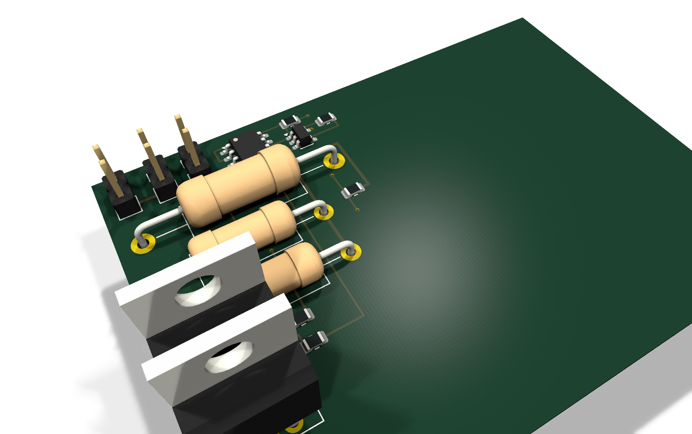

# KiCadAI

> **AI proposes. KiCadAI proves—or refuses.**

KiCadAI turns bounded behavioral requirements into deterministic,
evidence-backed native KiCad projects—and stops when it cannot prove a design
inside its reviewed component, model, simulation, and physical-design
envelope.

It is not a prompt-to-schematic wrapper or an unrestricted circuit oracle. The
AI-facing boundary accepts behavior; deterministic code owns architecture and
part selection, calculations, simulation, schematic and PCB generation,
placement, routing, validation, and the final pass-or-refuse decision.

## See The Proof

The featured demo asks for a protected 0.1 A/V programmable current output
across supply, load, startup, temperature, and safe-operating-area corners. Its
input names no component, topology, internal net, value, coordinate, layer, or
route.



```sh
make public-demo
```

On the recorded KiCad 10.0.3 run, KiCadAI derived 43 candidate graphs,
completed and simulated two competing physical architectures, performed 194
candidate simulations and 6,326 corner evaluations, selected real catalog
parts and values, and then generated the same native KiCad project twice.

| Required proof | Recorded result |
|---|---:|
| Behavioral architecture search | 2 complete simulation-passing architectures |
| Placement and routing | 15/15 components placed; 12/12 nets routed |
| Connectivity | 0 unconnected endpoints or DRC unconnected items |
| Writer correctness | 10/10 checks passed |
| KiCad ERC / strict DRC | 0 / 0 violations |
| Normalized KiCad round trip | 0 differences |
| Deterministic physical replay | 2 identical project hashes |

Inspect the [input, native KiCad files, screenshots, commands, compact evidence
receipt, and video storyboard](examples/public-demo/protected-programmable-current-output/README.md).
The receipt binds the requirement, inventory, models, catalog, policy,
architecture ranking, physical output, and verification results with content
hashes. Run `make public-demo-refusal` to verify that an excessive thermal/SOA
request exits unsuccessfully and emits no KiCad project.

This is an ERC/DRC-checked deterministic candidate, **not a fabrication
release**. Human electrical, thermal, mechanical, compliance, and manufacturing
review remains required.

## What Makes It Different

- **Behavior in, proof out.** The open-topology input schema rejects component,
  topology, model, internal-net, value, geometry, route, provider, and repair
  instructions.
- **Search is deterministic and bounded.** Candidate generation, value
  selection, simulation corners, repairs, ranking, and tie-breaking are
  recorded and content-addressed.
- **KiCad is part of the evidence.** KiCadAI writes native `.kicad_sch`,
  `.kicad_pcb`, and `.kicad_pro` files, then uses installed KiCad for ERC,
  strict DRC, and normalized round trips.
- **Failure is a valid result.** Missing evidence, unsafe operating envelopes,
  unsupported behavior, exhausted search, incomplete routing, or validation
  failures stop project promotion instead of being papered over.
- **Claims have boundaries.** Supported, experimental, and unsupported states
  are explicit; experimental output cannot receive a promotion-pass or
  fabrication-ready claim.

The full path is:

```text
behavior → capability gate → topology/value search → trusted simulation
         → native schematic/PCB → placement/routing → KiCad + writer checks
         → identical replay → pass or refusal
```

## Capability At A Glance

| State | What it means today | Evidence |
|---|---|---|
| **Supported** | Reviewed slices of analog, protected current output, low-energy nonlinear/switching, mixed-domain control, MCU, power-tree, sensor, interface, and functional hierarchical four-layer generation can reach deterministic KiCad-backed pass evidence. | [Project status](docs/project-status.md), [mixed-domain held-out audit](specs/multi-stage-out-of-distribution-synthesis/AUDIT.md), [hierarchical four-layer audit](specs/human-quality-hierarchical-multilayer/AUDIT.md) |
| **Experimental** | Broader AI-proposed graphs and capability expansion may generate inspectable artifacts only with explicit opt-in; they cannot be promoted as fabrication-ready. | [Capability gating](docs/capability-gating.md), [AI generation](docs/ai-generation.md) |
| **Unsupported** | Arbitrary circuits and parts, mains/high-energy safety, RF power, unrestricted dense boards, unreviewed models, and automatic fabrication approval remain outside the proven envelope. | [AI readiness](docs/ai-readiness.md), [roadmap](specs/ROADMAP.md) |

The current V18 capability extension adds a version-isolated, catalog-backed
path for low-voltage, high-input-impedance, multi-output analog threshold
requirements. Its public replay case passes deterministic search, coupled value
selection, simulation, physical lowering, and two clean installed-KiCad
promotions without changing the frozen V6–V17 evaluator paths. This remains a
bounded capability, not arbitrary analog synthesis. See the
[V18 specification](specs/closed-loop-open-set-capability-expansion/V18_SPEC_ADDENDUM.md).

The frozen nonlinear/switching corpus provides an additional adversarial
check: five behavior-only positive cases pass, while two unsafe stress cases
and one unsupported dynamic envelope fail closed without a physical project.

The independently frozen mixed-domain corpus composes sensing, decisions,
feedback, nonlinear transfer, switching power, and protection without naming
architectures or parts. Eight feasible requirements reach deterministic
installed-KiCad pass evidence; one contradictory requirement and four unsafe or
unsupported requirements fail closed. See the [completion
audit](specs/multi-stage-out-of-distribution-synthesis/AUDIT.md).

A separately frozen physical-quality corpus proves a bounded next step: four
behavior-only mixed-signal, amplifier, protected-control, and regulated-power
requirements produce functional child sheets and deterministic four-layer
boards. Each passes two clean local installed-KiCad runs with complete routing,
controlled return-path evidence, filled planes, clean ERC/strict DRC, writer
correctness, and zero normalized round-trip differences. This is not a claim
that arbitrary dense boards are supported.

## Run It In Under Ten Minutes

You need Go 1.23 or newer and KiCad 9 or newer. KiCad 10.0.3 is the recorded
reference version. `protoc` is needed only when regenerating vendored protobuf
bindings.

```sh
git clone https://github.com/dshills/KiCadAI.git
cd KiCadAI
make public-demo
```

The demo detects standard macOS and Linux KiCad installations. If yours is in
a different location, set `KICADAI_KICAD_CLI`, `KICADAI_SYMBOLS_ROOT`, and
`KICADAI_FOOTPRINTS_ROOT` as shown in the
[demo instructions](examples/public-demo/protected-programmable-current-output/README.md#run-it).
The full raw search evidence can approach 1 GB; generated scratch output is
kept in the ignored `examples/.generated/` directory.

For a smaller first look without installed-KiCad proof, build the CLI and use
the direct writers or checked-in educational examples:

```sh
make build
./bin/kicadai --help
```

See [educational circuits](examples/educational/README.md), the
[CLI reference](docs/cli-reference.md), and the preserved
[detailed capability record](docs/capability-record.md).

## AI Generation

Compile an ordinary behavior-first request without allowing the provider to
choose topology, parts, nets, or layout:

```sh
kicadai \
  --file ./behavioral-request.txt \
  --provider openai \
  --ai-profile behavioral-intent-v1 \
  --output ./out/behavioral-request \
  intent compile
```

Only a `ready` result writes
`./out/behavioral-request/.kicadai/behavioral-design-request.json`. A
clarification result writes a hash-bound follow-up template; an unsupported
result writes stable capability-gap evidence and no executable design request.
See [Intent Planning](docs/intent-planning.md#behavioral-intent-compilation) for
the follow-up and project-creation flow.

Run the recorded protected USB-C LED profile with KiCad-backed checks:

```sh
mkdir -p ./out
kicadai --prompt-file examples/ai/usb_c_led_indicator_protected/prompt.txt \
  --provider recorded \
  --provider-record examples/ai/usb_c_led_indicator_protected/recorded-response.json \
  --output ./out/ai_usb_c_led_protected --overwrite \
  --kicad-cli /path/to/kicad-cli \
  --require-kicad-roundtrip --strict-diffs \
  design create
```

For a live request, load `OPENAI_API_KEY` from the shell or a secret manager and
replace the recorded-provider flags with `--provider openai`. Provider output is
strict-decoded and remains untrusted until deterministic and KiCad-backed gates
pass.

Agents that already have a valid `generic-circuit-v1` graph can avoid a provider:

```sh
kicadai capability generation --json
kicadai --request ./graph.json circuit preflight
kicadai --symbols-root /path/to/kicad-symbols \
  --footprints-root /path/to/kicad-footprints \
  circuit create --request ./graph.json --output ./out/project --overwrite
```

For rejected generic graphs, run `circuit repair-plan` first. It selects an
executable patch only when one safe correction is fully derived; otherwise it
stops for review. See the [CLI reference](docs/cli-reference.md#generic-circuit-repair-plan)
for the strict patch contract and evidence boundary.

See [AI Generation](docs/ai-generation.md) for bounded and generic modes, live
commands, evidence files, failure behavior, and current limits. AI agents
should also follow the [KiCadAI Agent Skill](docs/kicadai-agent-skill.md).

## Reproduce Promotion Evidence

From an unmodified checkout, run:

```sh
make promotion-bundle
make held-out-promotion-bundle
```

The command builds the repository CLIs, resolves the version and stock
libraries locked by `toolchain/kicad-promotion.lock.json`, bootstraps the
checksum-pinned distribution only when needed, executes every required scenario
twice, verifies all promotion gates and deterministic comparisons, and writes
one content-addressed bundle below
`.tmp/clean-checkout-promotion/bundles/`. No manually configured KiCad or
library paths are required. The output directory must not already exist.
The held-out target uses the same locked toolchain and verifier with the
versioned five-scenario matrix for the two newly supported families, writing
below `.tmp/held-out-capability-promotion/`.

Use `bundle-path.txt` to locate the bundle. Its included files and semantic
promotion claims can be verified offline:

```sh
.tmp/clean-checkout-promotion/bin/kicadai-promotion verify \
  --bundle "$(cat .tmp/clean-checkout-promotion/bundle-path.txt)"
```

This is release-validation evidence for the supported corpus, not a claim that
arbitrary designs or fabrication outputs are automatically qualified.

## Schematic IR

The schematic design/layout IR is a strict JSON handoff for circuit intent,
layout intent, and repair policy. It is not free-form natural language or KiCad
S-expression syntax.

```sh
kicadai --request examples/schematic-ir/led_indicator.json schematic-ir validate
kicadai --request examples/schematic-ir/led_indicator.json schematic-ir normalize
kicadai --request examples/schematic-ir/led_indicator.json \
  --output ./out/ir_led --overwrite schematic-ir write
```

See [Intent Planning And AI Workflow](docs/intent-planning.md) and the
[CLI Reference](docs/cli-reference.md).

## Documentation

Start with the [documentation index](docs/README.md).

| Topic | Reference |
|---|---|
| Featured end-to-end proof | [Protected Programmable Current Output](examples/public-demo/protected-programmable-current-output/README.md) |
| Current capabilities and limits | [Project Status](docs/project-status.md) |
| Detailed implementation record | [Capability Record](docs/capability-record.md) |
| Educational generated schematics | [Educational Examples](examples/educational/README.md) |
| Commands and live IPC | [CLI Reference](docs/cli-reference.md) |
| Natural-language provider workflow | [AI Generation](docs/ai-generation.md) |
| Behavioral compilation, structured intent, and planning | [Intent Planning](docs/intent-planning.md) |
| Circuit blocks | [Circuit Blocks](docs/circuit-blocks.md) |
| Components, symbols, and footprints | [Libraries And Components](docs/libraries-and-components.md) |
| Placement and routing | [Placement And Routing](docs/layout-routing.md) |
| Validation, writer checks, and round-trip | [Validation And Analysis](docs/validation-and-analysis.md) |
| Clean-checkout release evidence | [Validation And Analysis](docs/validation-and-analysis.md#reproducible-promotion-bundles) |
| Fabrication evidence | [Fabrication](docs/fabrication.md) |
| Direct KiCad file writers | [KiCad File Writers](docs/kicad-file-writers.md) |
| Tests, packages, and troubleshooting | [Development Reference](docs/development.md) |
| Specifications, evidence, and audits | [Specs Index](specs/INDEX.md) |
| Priorities toward broader autonomy | [Roadmap](specs/ROADMAP.md) |

## Development

```sh
make test
make lint
make build
```

See [Development Reference](docs/development.md) for focused tests, coverage,
protobuf maintenance, package boundaries, and troubleshooting.

## License

KiCadAI is licensed under the [MIT License](LICENSE). Vendored KiCad API
materials under `third_party/kicad/` retain their upstream licenses.
